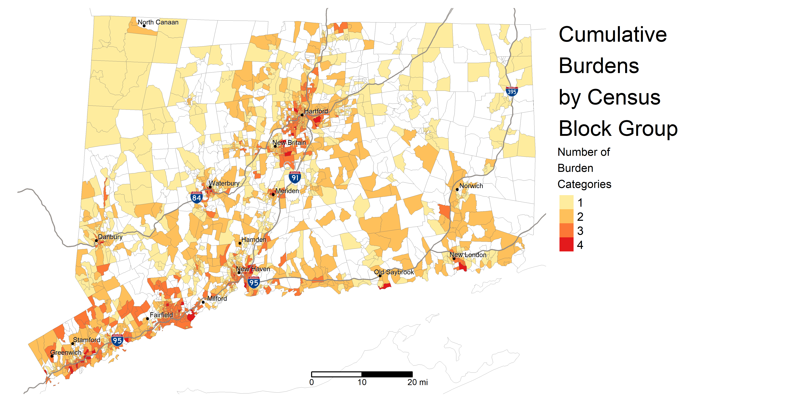
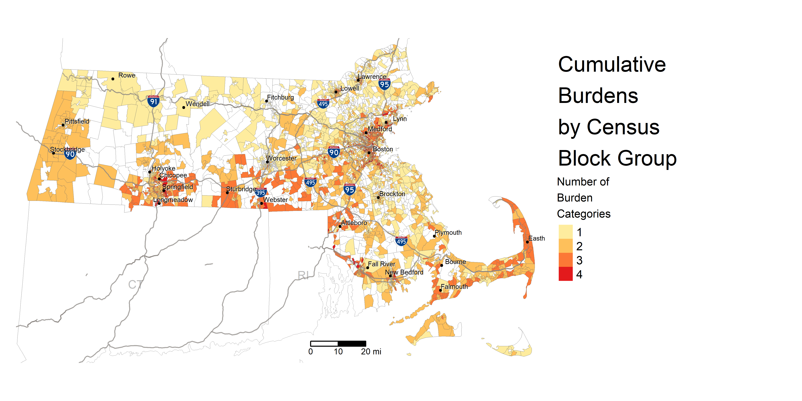
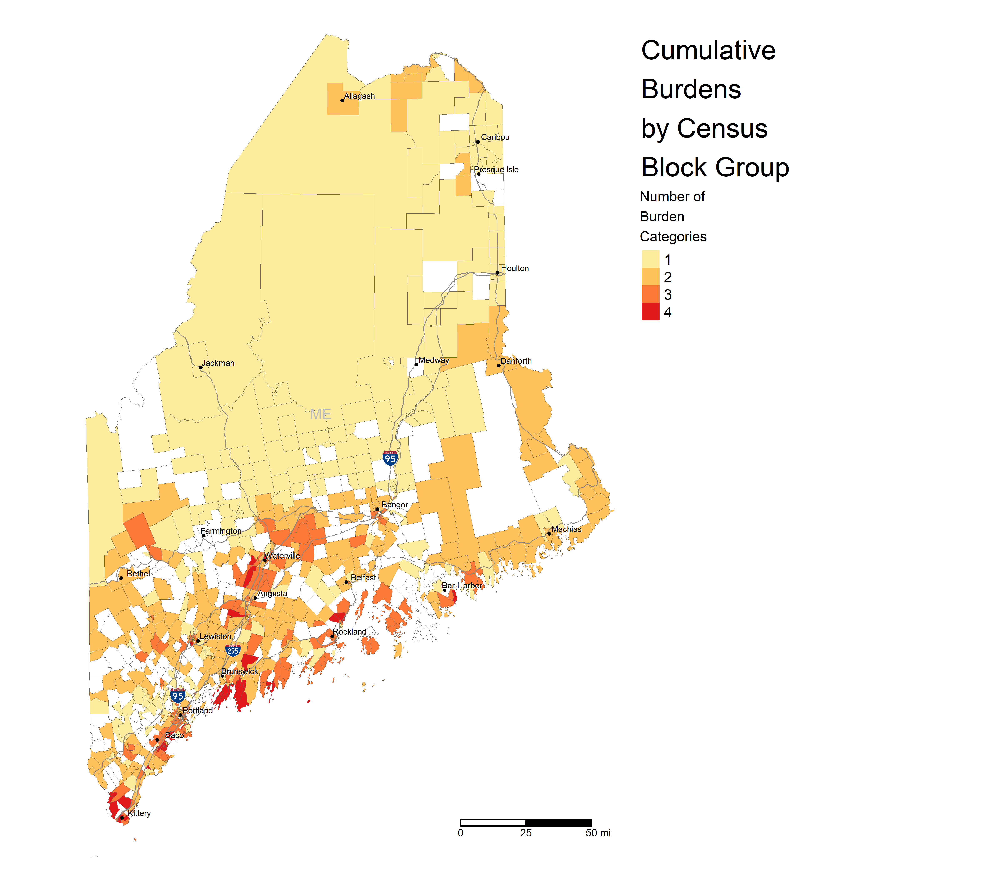
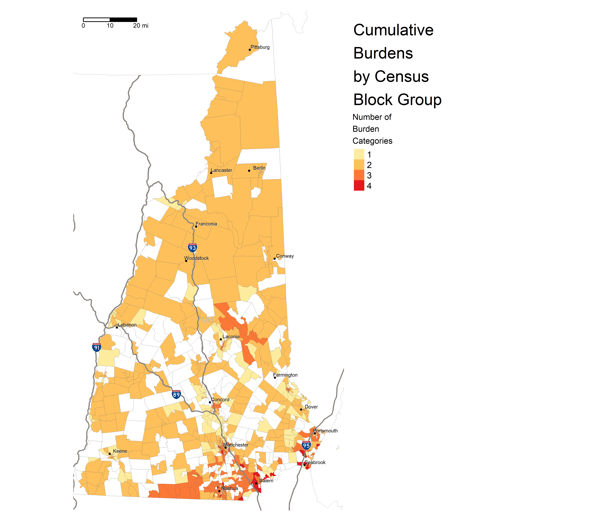
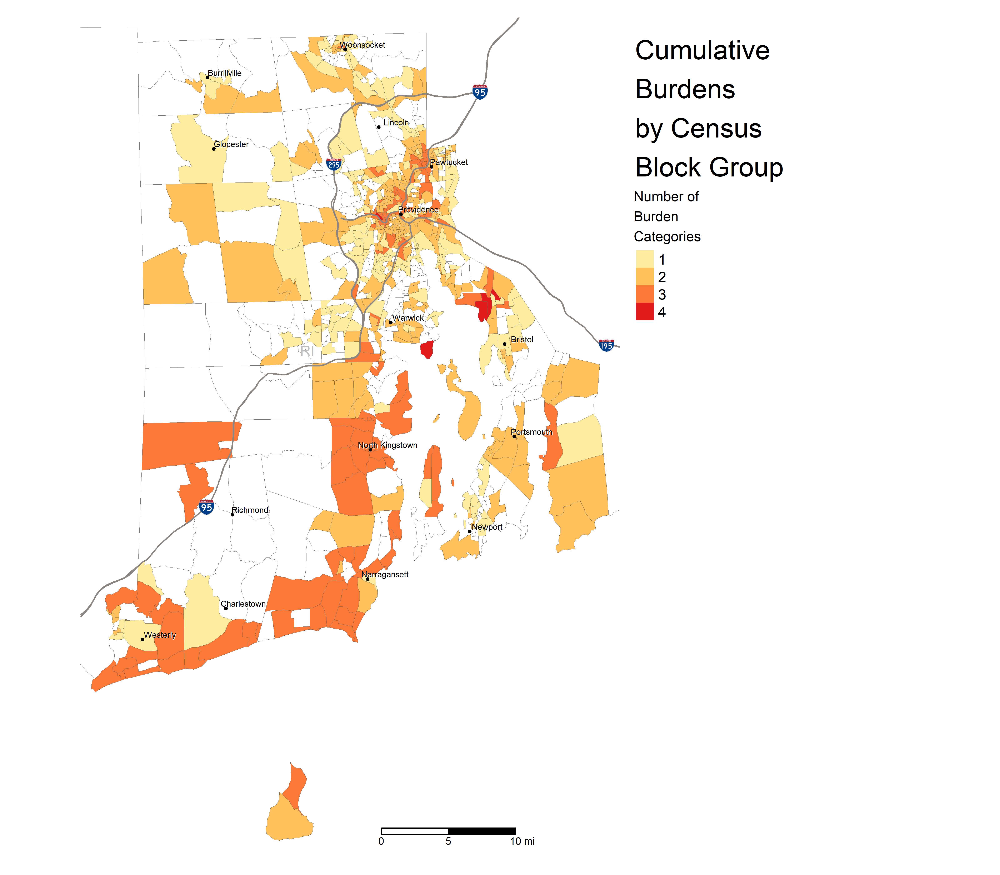
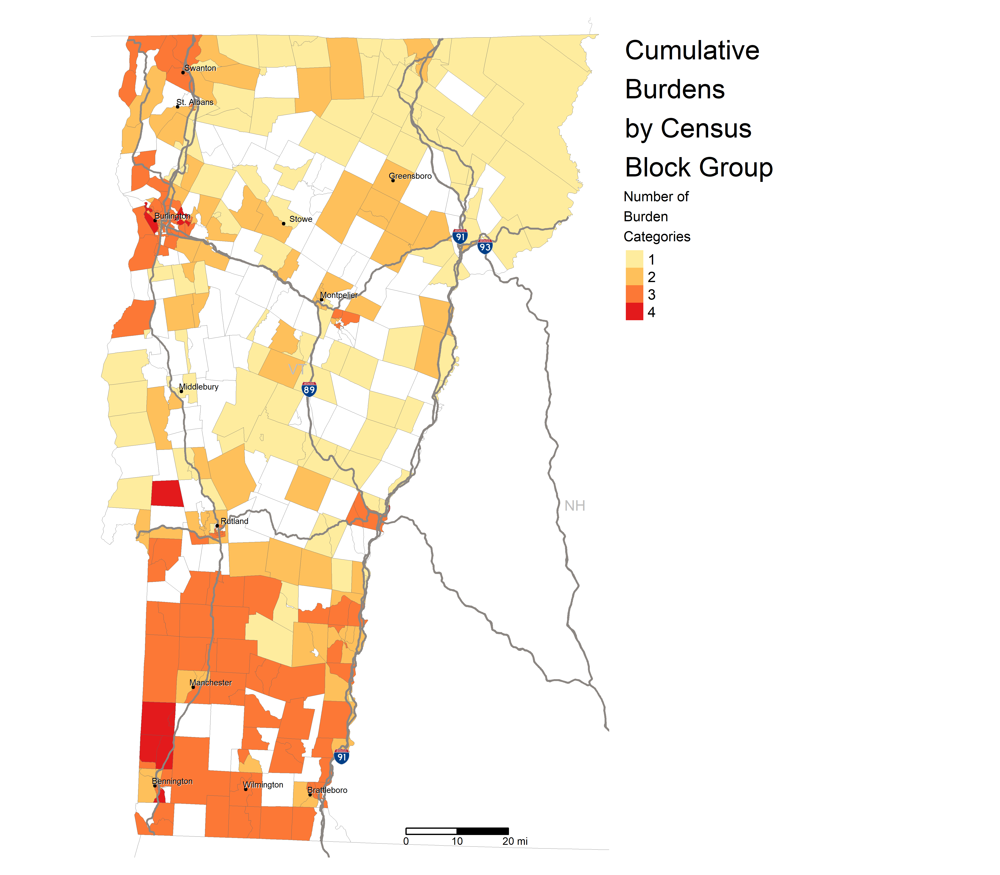

<style type="text/css">
.main-container {
  max-width: 60%;
  margin-left: auto;
  margin-right: auto;
  div.info.legend.leaflet-control br {clear: both;}
}
</style>

```{r, echo=FALSE, eval=FALSE}
htmltools::img(src = knitr::image_uri("images/CLFlogo100px.jpg"), 
               alt = 'CLF logo', 
               style = 'position:absolute; top:5; left:0; padding:10px;')
```

```{r setup, include=FALSE}
knitr::opts_chunk$set(echo=FALSE, message=FALSE, warning=FALSE)
# library(flexdashboard)
library(tidyverse)
library(sf)
library(tmap)
library(maptools)
# library(janitor)
# library(kableExtra)
library(tigris)
options(tigris_use_cache = TRUE, tigris_class = "sf")
library(leaflet)
library(leaflet.extras)
library(DT)
# set common data table options
# options(DT.options = list(scrollY="100vh", lengthMenu = c(5, 10, 15, 20)))
options(DT.options = list(lengthMenu = c(10, 20, 50, 100)))
library(highcharter)
library(rmapshaper)
library(metathis)
library(RColorBrewer)
library(knitr)

meta() %>%
  meta_description(
    "Environmental justice analysis of transportation-related burdens and benefits across New England") %>% 
  meta_viewport() %>% 
  meta_social(
    title = "Investing for Equity in New England",
    url = "http://dgl.salemstate.edu/luna/InvestingForEquity/NE/",
    og_type = "website",
    og_author = c("Marcos Luna", "Neenah Estrella-Luna"),
    twitter_card_type = "summary",
    twitter_creator = "@CLF"
  )
```

Transportation systems are crucial for the social and economic wellbeing of our society and our communities, and they are also major sources of environmental burden and inequity. The transportation sector is now the single largest source of climate-change inducing greenhouse gases (GHGs) in the U.S., and it is a major source of noxious and toxic pollution that directly degrades the health and safety of people, especially the most vulnerable amongst us. 

This website shares highlights from an analysis of the distribution of transportation-related burdens (e.g., pollution) and benefits (e.g., transit access) across the six New England states and the relationship of these burdens and benefits to priority populations. The goal is to provide guidance on policy recommendations for transportation investments that promote social and environmental equity and mitigate or prevent disparities and inequities in access to benefits and exposure to burdens. Select a state to learn more.

<br>

<br>

:::: {style="display: grid; grid-template-columns: 1fr 1fr; grid-column-gap: 10px; grid-template-rows: auto; grid-row-gap: 30px; "}

::: {}

[Connecticut](http://dgl.salemstate.edu/luna/InvestingForEquity/CT/)

:::

::: {}

[Massachusetts](http://dgl.salemstate.edu/luna/InvestingForEquity/MA/)

:::

::: {}

[Maine](http://dgl.salemstate.edu/luna/InvestingForEquity/ME/)

:::

::: {}

[New Hampshire](http://dgl.salemstate.edu/luna/InvestingForEquity/NH/)

:::

::: {}

[Rhode Island](http://dgl.salemstate.edu/luna/InvestingForEquity/RI/)

:::

::: {}

[Vermont](http://dgl.salemstate.edu/luna/InvestingForEquity/VT/)

:::

::::

```{r images1, include=FALSE, fig.show = "hold", out.width = "50%", fig.align = "default"}
# allows for images aligned side by side, but doesn't allow for hyperlinks


```

```{r images2, include=FALSE, fig.show = "hold", out.width = "45%", fig.align = "default"}


```

```{r images3, include=FALSE, fig.show = "hold", out.width = "40%", fig.align = "default"}


```

